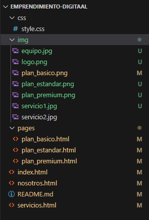
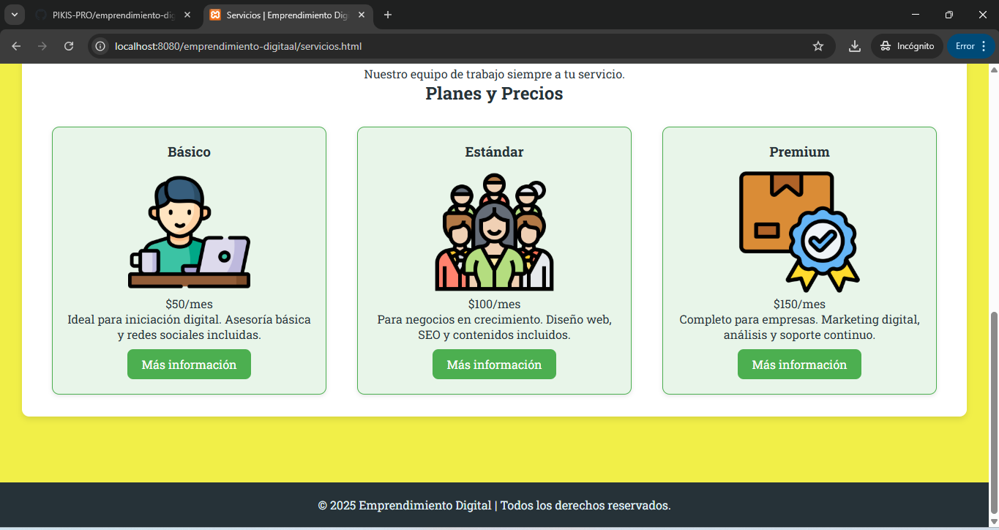

# Emprendimiento Digital

Taller Practico de HTML y CSS

## Comenzando 🚀

Esta practica muestra como aplicar estilos css a un sitio web construido con HTML.

En él, se desarrolla un sitio web sencillo al que se le aplican estilos visuales usando hojas de estilo en cascada. El sitio contiene una página de inicio, una sección de servicios con varios planes, una página de "Quiénes somos" y páginas con detalles para cada plan de servicio. El objetivo es lograr una presentación nítida que funcione bien en diferentes tipos de dispositivos.

## Estructura de mi practica 🛠️

_En la imagen podemos visualizar el orden en que se encuentra las carpetas en visual studio code_

 

## Características 🖇️✨

- Página principal informativa.
- Sección de servicios con planes detallados.
- Diseño estilado con CSS.
- Diseño adaptable.
- Botones con efectos interactivos.

## Clonar el repositorio 💻 📌

Para obtener una copia local del proyecto, puedes clonar el repositorio utilizando GitBash:

git clone git@github.com:PIKIS-PRO/emprendimiento-digital.git

Una vez que la clonación se complete, puedes entrar a la carpeta del proyecto con:

cd emprendimiento-digitaal

## Plataformas Utilizadas 💻 📌

*[Visual Studio Code](https://code.visualstudio.com/) - Editor de codigo fuente
* [Git Windows](https://git-scm.com/downloads/win) - Git Windows

## Autor ✒️

* **Martin Pico** - *Trabajo Inicial* - [PIKIS-PRO](https://github.com/PIKIS-PRO)

---
⌨️ con ❤️ por [Martin Pico](https://github.com/PIKIS-PRO) 😊
